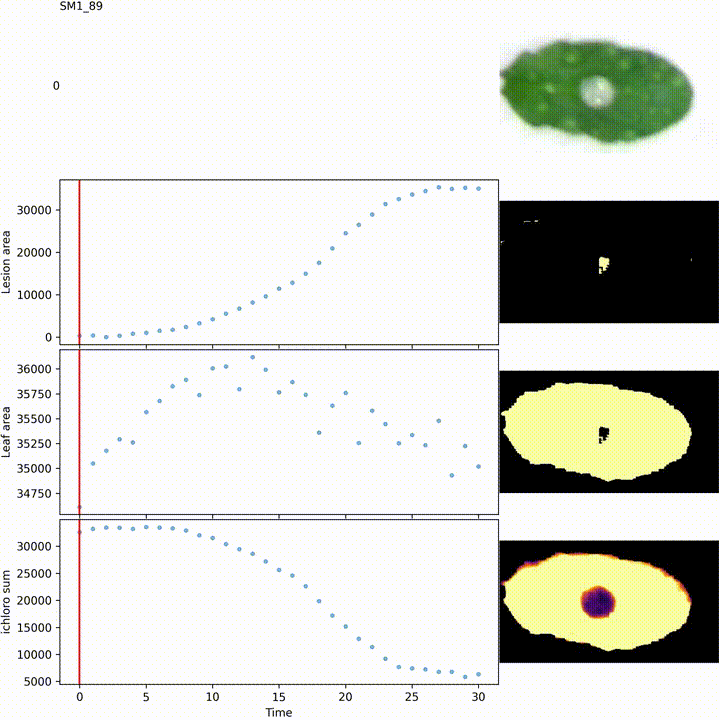

# INFEST

INFEST for k**IN**ematic o**F** l**ES**ion developmen**T** computes the kinematics of lesion development caused by the necrotrophic fungus _Sclerotinia sclerotiorum_.
INFEST was developed for [QIP](http://qiplab.weebly.com/overview.html) (quantitative immunity in plant) @ LIPM (Lab of plant microbes interaction) in Toulouse by Adelin Barbacci with contributions from Darcy Jones.
**INFEST was founded by Sylvain Raffaele's ERC varywim**.

Although the software was developed to phenotype _Sclerotinia sclerotiorum_ infections, it should also work well for other necrotrophic plant pathogens.


**For academic use please cite:**

> Barbacci, A., Navaud, O., Mbengue, M., Barascud, M., Godiard, L., Khafif, M., Lacaze, A., Raffaele, S., 2020 **Rapid identification of an Arabidopsis NLR gene conferring susceptibility to _Sclerotinia sclerotiorum_ using real-time automated phenotyping**. (2020) Plant J. 103(2) 903-917. [10.1111/tpj.14747](https://doi.org/10.1111/tpj.14747)





**We list the programs and options below, but you can also follow a worked example in the [tutorial](/TUTORIAL.md).**


## Quick install

The easiest way to install INFEST is with the conda package manager.
Instructions to install conda on linux are [here](https://docs.conda.io/projects/conda/en/latest/user-guide/install/linux.html)

I suggest that you install INFEST in a [conda environment](https://conda.io/projects/conda/en/latest/user-guide/tasks/manage-environments.html), because it avoids problems where you don't have permission to install software or if you need multiple versions of the same software (which might also be incompatible with other software).
To create an [environment](https://conda.io/projects/conda/en/latest/user-guide/tasks/manage-environments.html) you can run the following:

```
curl -o environment.yml https://raw.githubusercontent.com/darcyabjones/INFEST/master/environment.yml

conda env create -f environment.yml -p ./condaenv
conda activate ./condaenv
```

Then whenever you want to run the INFEST analysis in a new terminal, you just re-run `conda activate ./condaenv`.

If you want to update the version of INFEST, the easist thing is to just delete this folder and re-create the environment.

```
rm -rf -- ./condaenv
conda env create -f environment.yml -p ./condaenv
```


For other install options, see the [INSTALL.md](/INSTALL.md) page.


## Required inputs

- jpeg or png images stored in a directory and named by an integer _e.g._ `1.jpg` to `N.jpg` corresponding to the time course order.
  Numbers may be missing in the series (e.g. if you exclude a time point because the image is poor).
  Date and times as `YYMMDDHHMMSS` may also be appropriate. As long as they can be converted to integers and the sorted order corresponds to the time-course order it will work.
- The layout file described below.

A suggested folder structure is like this:

```
my_pictures/
    0.jpg
    1.jpg
    2.jpg
    3.jpg
    grid_layout/grid_layout.layout
```


The layout file is a tab separated file containing the leaf ids and positions leaf bounding boxes, with the following columns:


| column | type   | description                             |
|--------|--------|-----------------------------------------|
| id     | string | The sample id of the leaf               |
| ymin   | int    | The minimum y-value of the bounding box |
| xmin   | int    | As above but for x                      |
| ymax   | int    | The maximum y-value of the bounding box |
| xmax   | int    | As above but for x                      |


Note that this file should not have a header.
An example file is provided in `examples/layout.tsv`


**Some example images and layout files used for testing is available for [Arabidopsis](/src/INFEST/data/atha) and [Soybean](src/INFEST/data/gmax).**


## Run all steps with `infest`

The infest pipeline performs all steps described below: plots layout images, performs colour normalisation, quantification, and gompertz curve fitting all in one command.

I suggest that you perform an initial layout check with `infest-check-layout` before running the pipeline to make sure that your leaves are included in the bounding boxes correctly.
Then run the pipeline to get layout images on the colour corrected images.


```
usage: infest [-h] [-o OUTDIR] [--cn-type {nonuniform,uniform,none}] [--cn-gridsize CN_GRIDSIZE]
              [--cn-minsize CN_MINSIZE] [--cn-masktype {threshold,otsu,watershed}]
              [--qu-masktype {threshold,otsu,watershed,original,none}] [-n NCPU]
              [-a {mp4,gif,none}] [--animate-steps {layout,quant,both}] [--framestep FRAMESTEP]
              [--dpi DPI]
              layout images [images ...]

positional arguments:
  layout                Provide the locations of the leaves in your images.
  images                The path(s) to the image(s) you want to process.

options:
  -h, --help            show this help message and exit
  -o OUTDIR, --outdir OUTDIR
                        Where to save the pipeline results to.
  --cn-type {nonuniform,uniform,none}
                        How should we perform colour correction?
  --cn-gridsize CN_GRIDSIZE
                        How big should the grid be? NOTE: Smaller values use more memory. Default: 10
  --cn-minsize CN_MINSIZE
                        The minimum size of a foreground object for background detection. Default: 500.
  --cn-masktype {threshold,otsu,watershed}
                        What algorithm to use to detect the background during colour normalisation.
                        Note that the threshold method is not recommended, and was included for 
                        illustrative purposes. OTSU (the default) usually yeilds good results,
                        but may yield weird results if you have lots of dark patches (e.g. shadows)
                        or if your leaves have a similar colour as your background. The watershed
                        method is more accurate for those kinds of situations,
                        but takes a bit longer.
  --qu-masktype {threshold,otsu,watershed,original,none}
                        What algorithm to use to detect the background during quantification.
                        Default: none
  -n NCPU, --ncpu NCPU  How many images to process in parallel.
  -a {mp4,gif,none}, --animate {mp4,gif,none}
                        Write the layouts and quantifiation steps as animations in this format.
                        By default no animations are written. If you only want animations
                        for layout or quantification, use the --animate-steps option.
  --animate-steps {layout,quant,both}
                        Get the animations for only the check-layout step or the quantification step.
                        Only used if --animate is specified.
                        Default: both
  --framestep FRAMESTEP
                        If writing a video, how many milliseconds should each image be displayed for.
                        E.g. framestep=50 (default) means 20 images will be displayed per second.
  --dpi DPI 
                        What resolution should the output images and animations have? Default: 150
```


#### Output

All of the results from the commands `infest-check-layout`, `infest-norm`, `infest-quant`, and `infest-predict`.
Will be put under the specified `--outdir`.
Read the documentation of those tools to understand what they are.

Broadly, under your specified output directory, you'll have:

- `colour_normed` is a directory containing all colour normalised image files from your input.
- `check_layout` or `check_layout.mp4` or `check_layout.gif` the layout file overlayed on your normalised images.
- `quantification_results.tsv` contains the time-series measurements output from `infest-quant`.
- `gompertz-*` are the output files from `infest-predict` containing the fit coefficents and predictions from the Gompertz population ggrowth (or decay) model.


#### Examples

```
infest \
  --outdir infest_results \
  my_pictures/layout.txt \
  my_pictures/*.jpg


# Write animations
infest \
  --animate mp4 \
  --outdir infest_results \
  my_pictures/layout.txt \
  my_pictures/*.jpg
```


## Check layout with `infest-check-layout`

Check that your bounding boxes in the layout actually cover the leaves.

You can run this for a single image, or multiple.
Optionally, you can output an animation to easily check the boxes for the whole experiment run (e.g. accounting for movement and focus).

```
usage: infest-check-layout [-h] [-a] [-o OUTFILE] [--dpi DPI] layout images [images ...]

positional arguments:
  layout                A tsv file detailing the experiment layout.
  images                The path(s) to the image(s) you want to overlay the layout onto.

options:
  -h, --help            show this help message and exit
  -a {gif,mp4}, --animate {gif,mp4}
                        Should we write the output as a gif or mp4?
                        Default will predict from extension if outfile is given.
                        This option is provided in case you want a gif or mp4 but don't want the usual extension,
                        or you don't want to explicitly set the outfile name but want an animation.
  -o OUTFILE, --outfile OUTFILE
                        Where to save the output file(s) to.
                        If multiple images are provided, this should be a directory.
                        If you specify multiple images and the --animate option,
                        this should be the mp4 or gif filename.
                        If a single image is given, this should be the jpeg filename.
                        Default: grid_layout/panel.jpg, grid_layout/panel/{0..1}.jpg, grid_layout/panel.mp4, grid_layout/panel.gif
  -d DPI, --dpi DPI     What resolution should the output image(s) or animation have? Default: 150
  -s FRAMESTEP, --framestep FRAMESTEP
                        If writing a video, how many milliseconds should each image be displayed for.
                        E.g. framestep=50 (default) means 20 images will be displayed per second.
```


#### Output

A depending on the number of images provided:
- Single JPEG image showing leaf positions in the image.
- Multiple JPEG images in a directory.
- A single MPEG or GIF video.


#### Examples

```
# Single image
infest-check-layout -o grid_layout/panel.jpg layout.tsv 0.jpg

# Multiple images, will create a directory called 'grid_layout/panel'
infest-check-layout -o grid_layout/panel layout.tsv *.jpg

# A video
infest-check-layout -a mp4 -o grid_layout/panel.mp4 layout.tsv *.jpg

# Equivalently
infest-check-layout -o grid_layout/panel.mp4 layout.tsv *.jpg
```


## Normalise background colour with `infest-norm`

Lighting conditions can significantly effect the colour balance of images between time points.
To improve consistency we normalise the colour balance to an approximate known white background.

This script automatically finds the white background (i.e. paper towel/tissue paper on which the leaves are placed), 
and recalibrates the image to have a more normal colour balance.

By default, this recalibration applies non-uniformly across the image.
It is common, for example, for growth lights to illuminate the center of the nauvitron more than the edges.
Normalising to a single value typically causes the center to be saturated and the edges to be a bit too dark.
Instead, we find mean colour balances in a non-overlapping grid, and find a smoothed background colour gradient using b-splines, which simultaneously interpolates the expected values of the white background would have been behind the leaves.

You can apply a uniform recalibration by supplying the `--uniform` parameter.
If there is little apparent lighting difference across the image this gives reasonable results.

The background detection can be difficult in some cases and may affect the results.
The "watershed" method is the most accurate, but is a bit slower. Use this for images with especially dark patches.
For most cases the default "otsu" method works well, but may occasionally fail to mask out very light sections of the leaf.
In practise this doesn't matter much because the spline isn't strongly affected by extreme values.
Finally, although providing the layout grid (the same one used in the final `infest` program) is optional, it is highly recommended if you have very uneven lighting.
Sometimes the background detection will think a particularly dark patch of background is a leaf, and the background won't be normaliseed. Adding the layout simply excludes these regions.


```
usage: infest-norm [-h] [-l LAYOUT] [-o OUTDIR] [-u] [-g GRIDSIZE] [-m MINSIZE] [-t {threshold,otsu,watershed}] [-n NCPU]
                   images [images ...]

positional arguments:
  images                The path(s) to the image(s) that you want to normalise colours of.

options:
  -h, --help            show this help message and exit
  -l LAYOUT, --layout LAYOUT
                        Provide the locations of the leaves to help in finding the background (Recommended).
  -o OUTDIR, --outdir OUTDIR
                        Where to save the output file(s) to.
  -u, --uniform         Instead of applying region specific normalisation, normalise by average background
  -g GRIDSIZE, --gridsize GRIDSIZE
                        How big should the grid be? NOTE: Smaller values use more memory. Default: 10
  -m MINSIZE, --minsize MINSIZE
                        The minimum size of a foreground object for background detection. Default: 500.
  -t {threshold,otsu,watershed}, --masktype {threshold,otsu,watershed}
                        What algorithm to use to detect the background during colour normalisation.
                        Note that the threshold method is not recommended, and was included for 
                        illustrative purposes. OTSU (the default) usually yeilds good results,
                        but may yield weird results if you have lots of dark patches (e.g. shadows)
                        or if your leaves have a similar colour as your background. The watershed
                        method is more accurate for those kinds of situations,
                        but takes a bit longer.
  -n NCPU, --ncpu NCPU  How many images to process in parallel.
```

#### Examples

```
infest-norm \
  --outdir images_corrected \
  --masktype watershed \
  --ncpu 4 \
  images_raw/*.jpg
```

Will process each image in `images_raw` ending with the extension `.jpg`.
It will use the watershed method to distinguish the leaves from the background.
This will output a single colour corrected image for each input image into `images_corrected`.


## Quantification with `infest-quant`

Quantifies lesion characteristics for a given panel of leaves over many sampled times.
For each leaf bounding box indicated by the layout file, this program masks the background and quantifies the proportion of pixels where the red value is greater than green (lesion), green is greater than red (leaf=this + lesion area), and a linear model of the three channels indicating chlorophyll content.

Optionally, you can write animations of each leaf (which are helpful when evaluating curves).

Setting the best `--masktype` depends on your data and you may find it helpful to run multiple times with different values.
There is little difference in runtimes.
`watershed` (default) is the most accurate of the leaf detection methods, but it can still struggle with plugs close to the edges of leaves. This is recommended for many broad-leaf plants.
`none` means that the background is not removed at all and the values will include the background pixels.
However because the background is more-or-less static, this can help avoid much of the noise caused by difficulties in differentiating plugs or white regions of the background from the lesions. This is recommended for narrow leaves.
`original` is the original method based on a hard colour saturation threshold.

> *If you're getting quite noisy data, I highly recommend trying `--masktype none`.*


> NB. `infest-quant` used to be called as simply `infest`.
> This has been changed with the introduction of the pipeline program (combining all steps), which is now `infest`.

```
usage: infest-quant [-h] [-o OUTFILE] [-w WRITE_VIDEO] [-n NCPU] [-d DPI]
              [-s FRAMESTEP] [--normalise {uniform,nonuniform}]
              [-t {threshold,otsu,watershed,original,none}]
              layout images [images ...]

positional arguments:
  layout                Provide the locations of the leaves for quantification.
  images                The pictures you want to quantify.


options:
  -h, --help            show this help message and exit
  -o OUTFILE, --outfile OUTFILE
                        Where should we write the tab separated results?
                        Default: dirname/analysis.txt where "dirname" is the directory containing
                        the first image provided.
  -w WRITE_VIDEO, --write-video WRITE_VIDEO
                        Write videos of samples to this directory.
  -a {gif,mp4}, --animate {gif,mp4}
                        If --write-video is specified, what video format should the files be?
                        Default: mp4, requires ffmpeg. GIF has no additional dependencies.
  -n NCPU, --ncpu NCPU  How many images to process in parallel.
  -d DPI, --dpi DPI     If writing a video, what resolution should it have? Default: 150
  -s FRAMESTEP, --framestep FRAMESTEP
                        If writing a video, how many milliseconds should each image be
                        displayed for. E.g. framestep=50 (default) means 20
                        images will be displayed per second.
  -t {threshold,otsu,watershed,original,none}, --masktype {threshold,otsu,watershed,original,none}
                        What algorithm to use to detect the background. Default: watershed
```


#### Output

A tab separated file with 6 columns:

| column      | type   | description                                                   |
|-------------|--------|---------------------------------------------------------------|
| id          | string | The sample id of the leaf                                     |
| time        | int    | The time point that the measurement is from                   |
| lesion_area | int    | The number of pixels where the (1.1 * red) > green            |
| leaf_area   | int    | lesion_area + the number of pixels where (1.1 * red) < green  |
| ichloro_sum | float  | The chlorophyll content index                                 |
| x           | float  | The x mid-point of the bounding box given in the layout file  |
| y           | float  | The y mid-point of the bounding box given in the layout file  |

An example result is provided in `examples/analysis.tsv`

If `--write-video` is given a directory, mp4 (or gif) videos of each leaf will be written to that directory.
The directory will be created if it doesn't already exist.

> Writing the animations is quite slow. A regular analysis of ~400 images might take 2 mins to complete,
> but then the animations could take a few hours to write.
> If you want to experiment with different `--masktype` values, I suggest you run
> it without animations first and then run with animations for the final run.


#### Examples


```
# Runs the default pipeline.
# Results will be in my_pictures/analyse.txt
infest-quant my_pictures/grid_layout/grid_layout.layout my_pictures/*.jpg

infest-quant \
  --masktype original \
  my_pictures/grid_layout/grid_layout.layout \
  my_pictures/*.jpg

# As above but using the original background removal method.

# Runs the above but using 4 cpus, writing animations 
# into a new folder "my_animations", and providing an explicit out
# file name.
# Note that writing the animations can take a long time.
infest-quant --write-video my_animations \
  --ncpu 4 \
  --outfile my_analysis.tsv \
  my_pictures/grid_layout/grid_layout.layout \
  my_pictures/*.jpg
```


## Fit growth curves with `infest-predict`

This runs the automated curve fitting procedure based on Gompertz curves.
It fits a gompertz model and outputs useful measures such as the maximal slope, the Gompertz growth rate kG, and the upper and lower points on the curve.
It will also output predicted values based on the curve, and a multipage PDF showing the curve fit for all leaves.


```
usage: infest-predict [-h] [-o OUTPREFIX] infile

positional arguments:
  infile                The time-series data from infest-quant.

options:
  -h, --help            show this help message and exit
  -o OUTPREFIX, --outprefix OUTPREFIX
                        Where should we write the results?
```

Because Gompertz models fit a highly specific curve shape, the model is quite restricted and the fit may not appear to be particularly good.
Nevertheless most of the time when the data is reasonably good it does an excellent job.
With the new image processing (e.g. colour correction, no background masking, ichloro_sum) methods the curves are generally quite clean and the errors tend to occur if it encounters sharp turns at the beginning or end of the slope (which doesn't affect the slope calculation).
This is particularly true on more dense datasets.
The example data-sets are subsets of real data, where each photo represents a 1-2 hour interval (depending on the host) instead of the usual 10 minutes. The real datasets tend to yield better fits than the subsets.

I have not seen a better automatic method yet.
Other people have been essentially fitting a "broken stick" regression model. 
The problem with this is that the lines kind of go everywhere, and you have to pick a local regression line to represent the slope.
That's not always possible without recalculating the slopes to prevent a broken stick in the exponential growth phase.

If you do encounter a non-interactive better way, let me know and I can try to integrate it.


#### Output

This program writes multiple outputs all starting with the specified prefix (in `--outprefix`).

A multi-page PDF for each statistic is plotted with the original values and predicted curves and slopes.
Currently two statistics are predicted: the lesion size (`prefix-lesion_area.pdf`) and the ichloro sum (`prefix-ichloro_sum.pdf`).

In the files described below the lesion size and ichloro results are contained in a single file.
Users can select the statistic they're interested in from the last column using a simple filter.

##### `prefix-coef.tsv`

A tab separated file containing the coefficients of the fit gompertz curve.


| column     | type   | description                                                   |
|------------|--------|---------------------------------------------------------------|
| id         | string | The sample id of the leaf                                     |
| U          | float  | The lower plateau y value                                     |
| L          | float  | The upper plateau y value                                     |
| kG         | float  | The growth rate parameter                                     |
| Ti         | float  | The slope inflection point (i.e. with the maximum tangent).   |
| slope      | float  | The tangent at the inflection point.                          |
| yintercept | float  | The y-intercept where x=0 based on slope. Mostly for plotting. |
| sd         | float  | The sum of squared residuals of the model fit.                |
| statistic  | str    | The measured parameter. Either ichloro_sum or lesion_area.    |


##### `prefix-preds.tsv`

A tab separated file containing original time-points and measured values, predicted values based on the gompertz curve, and the tangents from the gompertz curves derivative.

| column     | type   | description                                                |
|------------|--------|------------------------------------------------------------|
| id         | string | The sample id of the leaf                                  |
| x          | float  | The original time point.                                   |
| y          | float  | The observed measurement value.                            |
| yhat       | float  | The predicted value based on the Gompertz curve.           |
| derivative | float  | The tangent (slope) for each point based on the curve.     |
| statistic  | string | The measured parameter. Either ichloro_sum or lesion_area. |


#### Examples

Say we had a file `my_analysis.tsv` from the output of `infest-quant`.

```
infest-predict --outprefix predict_results- my_analysis.tsv
```

Will create four files:

- `predict_results-coef.tsv`
- `predict_results-preds.tsv`
- `predict_results-ichloro_sum.pdf`
- `predict_results-lesion_area.pdf`


## Get example data with `infest-example`

We have a command to retrieve the example data we use for tutorials, testing and development.

```
usage: infest-example [-h] [-o OUTDIR] {atha,gmax,marca}

positional arguments:
  {atha,gmax,marca}     Which dataset to get.

options:
  -h, --help            show this help message and exit
  -o OUTDIR, --outdir OUTDIR
                        Where to save the example directory to.
                        Will raise an error if the target directory already exits.
```


#### Examples

```
infest-example -o ./my_atha_data atha
```

Will create a local folder `./my_atha_data` containing some arabidopsis example data.


## Troubleshooting

*The animations won't show in my video software*
The earlier versions of Darcy's infest updates used a codec that wasn't compatible with many players.
If you have animations from older versions, try running the following command in the same directory as the mpeg videos, to convert them to the more compatible mp4.

```bash
for MPG in *.mpeg
do
    ffmpeg -i "${MPG}" -c:v libx264 -strict -2 -preset slow -pix_fmt yuv420p -vf "scale=trunc(iw/2)*2:trunc(ih/2)*2" -f mp4 "${MPG%.mpeg}.mp4"
done
```


***

## Latest news

- Version 1 available
- An updated version of INFEST for Python3, with support for multiple cpus, background colour correction, and different masking options was contributed by Darcy Jones 


```
  ##     ###             ###     ##
 #       ###             ###       #
#                                   #
#        ###     ###     ###        #
#        ###     ###     ###        #
 #        #       #       #        #
  ##     #       #       #       ##

QiP Team LIPM Toulouse
```

## Contact us 

This software was primarily written by Adelin Barbacci, with contributions by Darcy Jones.
The best way to get help is to [raise an issue on GitHub](https://github.com/A02l01/INFEST/issues).
Alternatively, you can email us.

We are on also twitter
[AB](https://twitter.com/A_Barbacci),
[SR](https://twitter.com/QIPlab).
