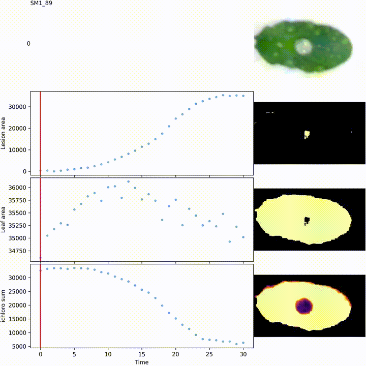

# INFEST tutorial

This tutorial leads you through the recommended INFEST pipeline using the included [Arabidopsis test images](/src/INFEST/data/atha).

Here we assume you are running a linux operating system with INFEST installed (and activated if you created a conda environment).
For Windows users i highly recommend setting up [WSL2](https://learn.microsoft.com/en-us/windows/wsl/install) or creating a virtual machine (e.g. https://www.virtualbox.org/).
With some minor code adaptations it should be possible to run the tutorial in windows CMD or Powershell.

## Data

First we'll get some example images.

We provide a simple command to copy example data for you.
We'll get the Arabidopsis dataset.

```
infest-example --outdir atha_example atha
# Creates a new folder 'atha_example'

ls atha_example
```

You should see a series of jpeg images and the layout folder.

You can also access these example datasets from our [github repository](https://github.com/darcyabjones/INFEST/tree/master/src/INFEST/data).


### Creation of the layout file

The example data already contains a layout file, but you could also create your own.
The easiest way to do this is to use [ImageJ/FIJI](https://imagej.net/software/imagej2/) and use the measurement tool.
Then copy the x and y ranges of a bounding box around each leaf.

A description of the layout file format is given in the [README](README.md).

You can then check that your layout file is ok:

```
infest-check-layout \
  -o atha_example/grid_layout/panel.jpg \
  atha_example/grid_layout/grid_layout.layout \
  atha_example/0.jpg
```

Have a look at `atha_example/grid_layout/panel.jpg` to see if the samples are well bounded.


### Normalise the colours

We use blue LED growth lights when running the imaging experiments.
This leaves a blue tint to the leaves which can interfere with quantification.
This step removes that blue colour and also makes the lightness more uniform across the image.

```
infest-norm \
  --layout atha_example/grid_layout/grid_layout.layout \
  --outdir atha_example_norm \
  --ncpu 4 \
  atha_example/*.jpg

# Creates a new folder 'atha_example_norm'

ls atha_example_norm
```

At this point you might like to compute an animation of the layout again.
This animation can be helpful in identifying samples with unusual lesions that should be excluded later.

```
# Note that we're setting the --framestep here because we only have 30 images,
# so the animation is very short with 50 milliseconds per image (20 per second).
# Normally (with ~300 images) the default is good.

infest-check-layout \
  -a \
  -o atha_example_norm.mp4 \
  --framestep 100 \
  atha_example/grid_layout/grid_layout.layout \
  atha_example_norm/*.jpg
```

Have a look at the video and see if everything looks good.


### Compute kinematics of Lesion


```
# Note that we're setting the --framestep here because we only have 30 images,
# so the animation is very short with 50 milliseconds per image (20 per second).
# Normally (with ~300 images) the default is good.

infest \
  --ncpu 4 \
  --write-video ./leaf_animations \
  --framestep 100 \
  --outfile my_analysis.tsv \
  atha_example/grid_layout/grid_layout.layout \
  atha_example_norm/*.jpg

head my_analysis.tsv
```

So you now have the leaf and lesion areas for each leaf at each time step.
In the folder `leaf_animations` you should have a video for each leaf showing the lesion development alongside the measured values.




### Finding the slope to summarise lesion growth velocity.

> NOTE: these R-scripts are a bit rough and you may have trouble using them.
> Please adapt them as you wish.

The lesion slopes can be difficult to determine automatically, so the current best method 
is to manually curate the slopes and select something reasonable.

The R-scripts in `scripts/` can help you to interactively select the best regions to find the slopes.

You'll need to have the following R packages:

- tidyverse
- ggplot2
- ggrepel
- segmented
- cowplot

For the `slopes_spline.R` version you'll also need the `splines` package.

```r
install.packages(c("tidyverse", "ggplot2", "ggrepel", "segmented", "cowplot"))
```

To use the script, you can download it locally:

```
curl -o slopes.R https://raw.githubusercontent.com/darcyabjones/INFEST/master/scripts/slopes_linear.R

# OR
curl -o slopes.R https://raw.githubusercontent.com/darcyabjones/INFEST/master/scripts/slopes_spline.R
```

Now open an interactive R terminal (e.g. Rstudio), and `source` this script to use the main function `compute_slope`.

```r
source("slopes.R")

# Load your data
df <- readr::read_tsv("./my_analysis.tsv")

# If you selected slopes_linear.R
compute_slope(df, "manual_slopes.tsv")

# OR if you used slopes_spline.R
process_file(df, "manual_slopes.tsv", "lesion_area")
```

You'll be presented plots of the data and asked to enter ranges and check whether the data are ok.
You may wish to view the animated videos if the curve is a bit odd.


Again, determining the slope is difficult and the R-scripts are evolving and not very universal.
We don't yet have a perfect solution.
The linear method has been used in the lab for some time.
The spline method was developed by Darcy as an attempt to determine the best slope automatically.


### Challenge

Try running the tutorial again but using the `marca` dataset.
You'll see that the different colour balance and very narrow leaves makes this dataset much more difficult to get good results for.

- What happens if you don't provide the layout file to `infest-norm`?
- What happens if you use a different `infest --masktype` values (e.g. `none`)?
