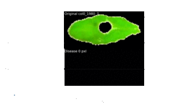
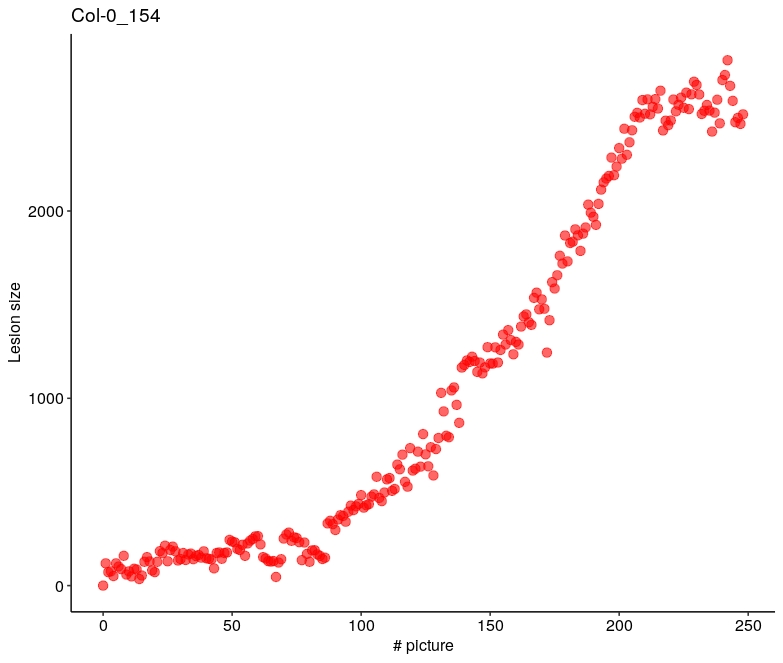

# INFEST
## Overview
INFEST for k**IN**ematic o**F** l**ES**ion developmen**T**. This plugin was used to compute the kinematic of lesion caused by the necrotrophic fungus _Sclerotinia sclerotiorum_. INFEST was developed for QIP (quantitative immunity in plant) @ LIPM (Lab of plant microbes interaction) in Toulouse by Adelin Barbacci. Feel free to use it.
For academics used please cite :

Barbacci, A., Navaud, O., Mbengue, M., Vincent, R., Barascud, M., Aline, L., Raffaele, S., n.d. **Rapid identification of an Arabidopsis NLR gene conferring susceptibility to Sclerotinia sclerotiorum using real-time automated phenotyping**. Rev.

### command line :

infest.py path_containing_images start stop
- path_containing_images the full path of the directory containing pictures (e.g. /home/foo/bar/)
- start (optional, default 0) an integer corresponding to the first image to consider.
- stop (optional, default max(image_name)) an integer corresponding to the last image to consider.

### Examples
- infest.py /home/foo/bar/ 0 250
- infest.py /home/foo/bar/ 0
- infest.py /home/foo/bar/

### To go further
To compute the growth rate associated to kinematic of lesion development we advice to use the 'segmented' R library after a log transform of the curve obtained with INFEST.
### Latest news
- Version 1 available

# Getting started
## Details
This version has been developed and tested under ubuntu 18.10 with python 2.7. The dependancies are:
- matplotlib==2.2.4
- numpy==1.16.5
- scikit-image==0.14.5

## Prerequists
Having python and conda install on your machine.
- For linux install please see: https://docs.conda.io/projects/conda/en/latest/user-guide/install/linux.html
- For other systems: https://docs.conda.io/projects/conda/en/latest/user-guide/install/#system-requirements
## Installation instructions
Creation of a conda environment

_conda env create _n INFEST -f env_Infest.yml_

_conda activate INFEST_

_python infest.py path_to_picture _

# Tuto
All data are in the data_tuto/ directory

## Prerequist
Name of images 1.jpg to N.jpg
Layout file grid_layout.layout in the directory
Layout file must is composed by 'name'<tab>'ymin','xmin','ymax','xmax'
## Command line prototype
infest.py path_containing_images start stop

